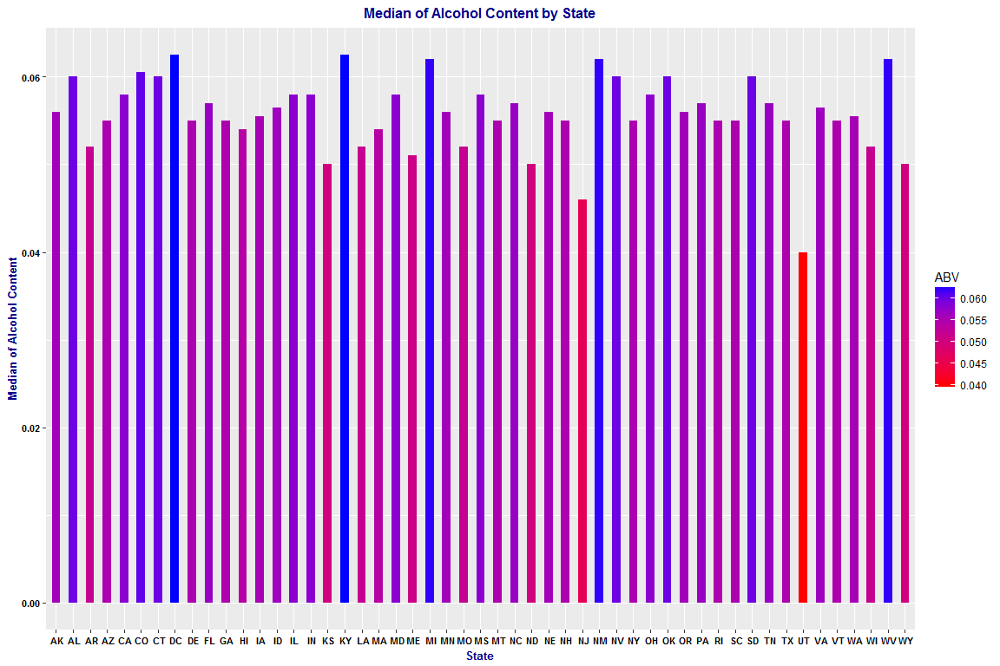
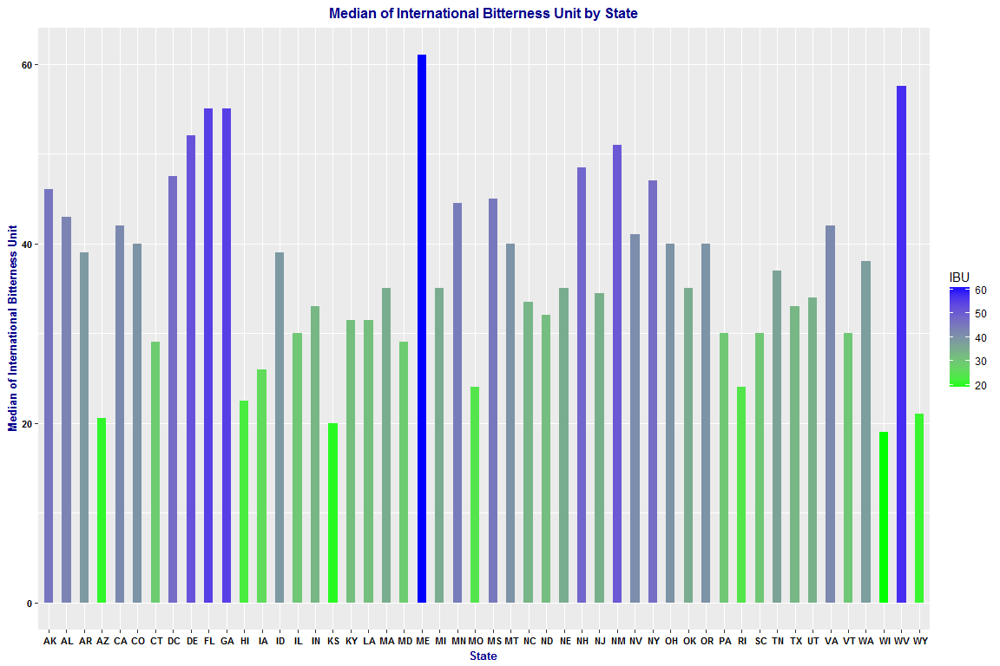
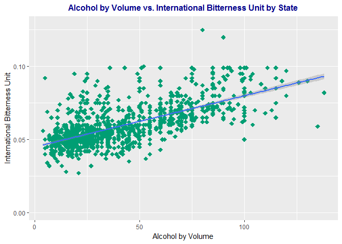
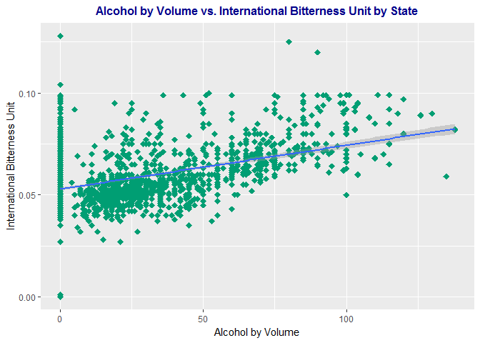

# Case Study 1
Andrew Donate  
June 27, 2017  

#**Introduction:**#
####_This document contains the final analysis performed on two datasets: Beers.csv and Breweries.csv.  The Beers dataset contains a list of 2,410 US craft beers and the Breweries dataset contains 558 breweries. This analysis consists of completely merging the two datasets and running statistical functions on the dataset. These functions include: counts of missing data, calculating the median alcohol content and the median for international bitterness unit of the beers for each state. Furthermore, I identify which states have the most alcoholic beer and the most bitter beer. Moreover, to support these claims, this document also contains two plots so the results can be visualize accordingly.  Finally, the last of the analysis displays five summarized statistics and a scatterplot to possibly show a moderate and positive relationship between the alcoholic content and the bitterness of the beer. My claim based on the below analysis is: as the alcohol by volume increases so does the bitterness of the beer. The following output is based on my analysis of the dataset.      _###   

#####The following R libraries are used in this analysis: count, sum, summary and plotting functions:#####
#####_(Suppress version warning message in output for libraries...)_#####

```r
library(plyr)
library(ggplot2)
library(knitr)
```

#####Set the working directory and read in both .csv files keeping the header information intact; The two datasets are Beer_Set and Brewery_Set respectively:#####

```r
setwd("E:/Users/Andy/Desktop")
Beer_Set <- read.csv("Beers.csv", header= TRUE)
Brewery_Set <- read.csv("Breweries.csv", header= TRUE)
```

#####Since we now have the data imported into the datasets, the analysis begins and the following code shows the number (count) of breweries in each state. Also, using the 'names' function changes the name the second column to "Count":#####

```r
Brewery_by_State <- count(Brewery_Set, "State")
names(Brewery_by_State)[2] <- "Count"
Brewery_by_State[1:2]
```

```
##    State Count
## 1     AK     7
## 2     AL     3
## 3     AR     2
## 4     AZ    11
## 5     CA    39
## 6     CO    47
## 7     CT     8
## 8     DC     1
## 9     DE     2
## 10    FL    15
## 11    GA     7
## 12    HI     4
## 13    IA     5
## 14    ID     5
## 15    IL    18
## 16    IN    22
## 17    KS     3
## 18    KY     4
## 19    LA     5
## 20    MA    23
## 21    MD     7
## 22    ME     9
## 23    MI    32
## 24    MN    12
## 25    MO     9
## 26    MS     2
## 27    MT     9
## 28    NC    19
## 29    ND     1
## 30    NE     5
## 31    NH     3
## 32    NJ     3
## 33    NM     4
## 34    NV     2
## 35    NY    16
## 36    OH    15
## 37    OK     6
## 38    OR    29
## 39    PA    25
## 40    RI     5
## 41    SC     4
## 42    SD     1
## 43    TN     3
## 44    TX    28
## 45    UT     4
## 46    VA    16
## 47    VT    10
## 48    WA    23
## 49    WI    20
## 50    WV     1
## 51    WY     4
```

#####Now, to analyze the datasets and to extract relevant information from them, I will need to merge both datasets into one master dataset. In order to do this, there needs to be a common key identifier to merge on and since both datasets have a brewery ID; however, their spelling is not identical so I need to change the column heading in the Brewery_Set to "Brewery_ID" therefore it matches in the Beer_Set.  The second line of code will change the "Name" column in the Beer_Set to "Beer_Name"" to reduce the ambiguity between the column headings once the datasets are merged. I Used the 'names' function to change the column heading in the Beer_set as shown below.#####

```r
names(Brewery_Set) <- c("Brewery_id", "Brewery_Name", "City", "State")
names(Beer_Set)[1] <- "Beer_Name"
```
#####Executed the following code in order to verify the changes were made to the column headings in the datasets...#####

```r
names(Brewery_Set)
```

```
## [1] "Brewery_id"   "Brewery_Name" "City"         "State"
```

```r
names(Beer_Set)
```

```
## [1] "Beer_Name"  "Beer_ID"    "ABV"        "IBU"        "Brewery_id"
## [6] "Style"      "Ounces"
```

#####The following three lines of code merges both datasets keying on the common identifier: "Brewery_ID".  The Head and Tail functions will show the first and last 6 lines of the merged dataset.  This will validate whether or not all columns successfully merged into one dataset.#####

```r
Merge_data_set <- merge(Beer_Set, Brewery_Set, by = "Brewery_id")
head(Merge_data_set, 6)
```

```
##   Brewery_id     Beer_Name Beer_ID   ABV IBU
## 1          1  Get Together    2692 0.045  50
## 2          1 Maggie's Leap    2691 0.049  26
## 3          1    Wall's End    2690 0.048  19
## 4          1       Pumpion    2689 0.060  38
## 5          1    Stronghold    2688 0.060  25
## 6          1   Parapet ESB    2687 0.056  47
##                                 Style Ounces       Brewery_Name
## 1                        American IPA     16 NorthGate Brewing 
## 2                  Milk / Sweet Stout     16 NorthGate Brewing 
## 3                   English Brown Ale     16 NorthGate Brewing 
## 4                         Pumpkin Ale     16 NorthGate Brewing 
## 5                     American Porter     16 NorthGate Brewing 
## 6 Extra Special / Strong Bitter (ESB)     16 NorthGate Brewing 
##          City State
## 1 Minneapolis    MN
## 2 Minneapolis    MN
## 3 Minneapolis    MN
## 4 Minneapolis    MN
## 5 Minneapolis    MN
## 6 Minneapolis    MN
```

```r
tail(Merge_data_set, 6)
```

```
##      Brewery_id                 Beer_Name Beer_ID   ABV IBU
## 2405        556             Pilsner Ukiah      98 0.055  NA
## 2406        557  Heinnieweisse Weissebier      52 0.049  NA
## 2407        557           Snapperhead IPA      51 0.068  NA
## 2408        557         Moo Thunder Stout      50 0.049  NA
## 2409        557         Porkslap Pale Ale      49 0.043  NA
## 2410        558 Urban Wilderness Pale Ale      30 0.049  NA
##                        Style Ounces                  Brewery_Name
## 2405         German Pilsener     12         Ukiah Brewing Company
## 2406              Hefeweizen     12       Butternuts Beer and Ale
## 2407            American IPA     12       Butternuts Beer and Ale
## 2408      Milk / Sweet Stout     12       Butternuts Beer and Ale
## 2409 American Pale Ale (APA)     12       Butternuts Beer and Ale
## 2410        English Pale Ale     12 Sleeping Lady Brewing Company
##               City State
## 2405         Ukiah    CA
## 2406 Garrattsville    NY
## 2407 Garrattsville    NY
## 2408 Garrattsville    NY
## 2409 Garrattsville    NY
## 2410     Anchorage    AK
```

#####The next lines of code reports the number of missing values (NA's) and/or blanks in each of the columns of the merged dataset. The first line searches for any missing values that are blanks (no NAs written during the input) and places a "NA"" in that cell so the next line of code picks it up and counts it. This code uses the 'colSums' function which will output the total number of NAs for each column in the dataset.#####

```r
is.na(Merge_data_set) <-  Merge_data_set == ""
colSums(is.na(Merge_data_set))
```

```
##   Brewery_id    Beer_Name      Beer_ID          ABV          IBU 
##            0            0            0           62         1005 
##        Style       Ounces Brewery_Name         City        State 
##            5            0            0            0            0
```

#####The output above shows there are three columns that have "NAs".  The ABV showing 62 while the IBU shows a large number of missing values of 1,005.  Both of these columns had the "NAs"" written in during the read input of the files.  The Style column shows 5 "NAs" but these missing values (due to being a string) were not converted during the read input but were converted to "NAs" by the above code (first line).     #####

#####The next part of the analysis computes the median alcohol content (ABV) and the median international bitterness unit (IBU) for all of the beers grouped by each state.  The code also removes any missing values (NAs) from the datasets and calculates both Medians and places the results in the "Plot_ABV_Set" and the "Plot_IBU_Set" vectors, respectively.  I Used the 'aggregate' function with the 4 options to accomplish this requested analysis.  These two datasets will be used in the next chunk of code for plotting.#####

```r
Plot_ABV_set <- aggregate(ABV ~ State, data=Merge_data_set, FUN=median, na.rm=TRUE)
Plot_IBU_set <- aggregate(IBU ~ State, data=Merge_data_set, FUN=median, na.rm=TRUE)
```

#####The code below takes the two above datasets (Plot_ABV_set and Plot_IBU_set) and plots their calculated state Medians on two individual bar charts for comparative analysis.  The following code uses the 'ggplot' function to generate the two plots; forced the plot to be wider (using the fig.x options) so the state abbreviations can be easily read:#####

```r
ggplot(Plot_ABV_set, aes(x = factor(State), y = ABV, fill = ABV)) + geom_bar(stat = "identity", width = 0.5) + 
  scale_fill_gradient(low="#FF0000",high="#0000FF") +
  theme(axis.title = element_text(color="darkblue", face="bold", size=10)) +
  theme(axis.text=element_text(color="black", face="bold", size=8)) +
  theme(plot.title = element_text(color="darkblue", face="bold", size=12)) +  
  theme(plot.title = element_text(hjust = 0.5)) + 
  xlab("State") + ylab("Median of Alcohol Content") + ggtitle("Median of Alcohol Content by State")
```

<!-- -->

```r
ggplot(Plot_IBU_set, aes(x = factor(State), y = IBU, fill= IBU)) + geom_bar(stat = "identity", width = 0.5) + 
  scale_fill_gradient(low="#00FF00",high="#0000FF") +
  theme(axis.title = element_text(color="darkblue", face="bold", size=10)) +
  theme(axis.text=element_text(color="black", face="bold", size=8)) +
  theme(plot.title = element_text(color="darkblue", face="bold", size=12)) +  
  theme(plot.title = element_text(hjust = 0.5)) + 
  xlab("State") + ylab("Median of International Bitterness Unit") + ggtitle("Median of International Bitterness Unit by State")
```

<!-- -->

#####Interpretation of the two bar charts, the ABV Medians appear to fall between 4% and 6.25% for each of the states, with approximately seven states hitting the 6% alcohol content mark. For the IBU bar chart, the IBU numbers appear to have a larger spread than the ABV range with its range falling between 20 and 61 IBUs for the 50 states. Only two states appear to be close or over the 60 IBU mark.   ######

#####Deeper into the analysis, I need to extract which state has the highest alcoholic beer and which state has the most bitter beer.  This is fairly straightforward in R by simply running the 'max' function in order to obtain the highest ABV and IBU values for the states.   #####

#####Moreover, the code uses a which statement (similar to an if statement) to select and return the max value, beer brand and corresponding state from each of the two small datasets#####

```r
ABV_max <- Merge_data_set[which.max(Merge_data_set$ABV),c(2,4,10)]
IBU_max <- Merge_data_set[which.max(Merge_data_set$IBU),c(2,5,10)]
ABV_max
```

```
##                                                Beer_Name   ABV State
## 375 Lee Hill Series Vol. 5 - Belgian Style Quadrupel Ale 0.128    CO
```

```r
IBU_max
```

```
##                      Beer_Name IBU State
## 1857 Bitter Bitch Imperial IPA 138    OR
```

#####The above output displays the states that have the highest ABV and the highest IBU value; these values are as follows: Colorado with 12.8% ABV and Oregon with a 138 IBU.    #####

#####Next, I run more descriptive statistics on the ABV (Alcohol by Volume) column for each state by using the 'summary' function. This function returns the minimum, Q1, Median, Mean, Q3 and the maximum numbers from a given vector/dataset:#####

```r
summary(Plot_ABV_set$ABV)
```

```
##    Min. 1st Qu.  Median    Mean 3rd Qu.    Max. 
## 0.04000 0.05500 0.05600 0.05585 0.05800 0.06250
```
#####The 'summary' function just returns the 5 common descriptive statistics commonly found on the boxplot. These are Min: 4.0%; 1st Qu: 5.5%; Median: 5.6%; Mean: 5.585%; 3rd Qu: 5.8% and Max: 6.25%.   #####

#####The last part of analyzing this dataset is to determine whether or not a relationship exists between the bitterness of beer and its alcohol content based on a scatterplot interpretation.  The following code produces a high leverage and high residual plot of the Alcohol by Volume (y-axis - response variable) and the International Bitterness Unit (x-axis - explanatory variable) to possibly show a relationship. The plot is drawn by the ggplot function using several different options such as 'theme' to enhance the visualization and to aid in the interpretation.  Also, the plot uses the method=lm for a fit linear model to carry out regression. A line and a cone is drawn on the plot to aid in the interpretation of it.     #####

```r
ggplot(Merge_data_set, aes(IBU, ABV)) +
  geom_point(colour = "#009E73", shape = 18, size = 3) +
  theme(plot.title = element_text(color="darkblue", face="bold", size=12)) +  
  theme(plot.title = element_text(hjust = 0.5)) + 
  xlab("Alcohol by Volume") + ylab("International Bitterness Unit") + ggtitle("Alcohol by Volume vs. International Bitterness Unit by State") +
  geom_smooth(method='lm')
```

```
## Warning: Removed 1005 rows containing non-finite values (stat_smooth).
```

```
## Warning: Removed 1005 rows containing missing values (geom_point).
```

<!-- -->

#####Interpreting the above scatterplot, I can assume there is a moderate relationship between the bitterness of the beer and its alcohol content.  This plot is factoring out the South Dakota (SD) outlier. SD contains a missing value (NA) within its IBU field.  The results tend to show a moderate-positive relationship as noted by the slope of the line of the two variables. Even though there are a few outliers in the dataset and displayed accordingly on the plot, the overall pattern of the data can be described by the direction, form and strength of the relationship between the two variables.       #####

#####If the South Dakota outlier was left in the dataset (set to zero by the first line of code in the following chunk) will it make a difference in the relationship between the ABV and the IBU variable? To answer this question, the missing IBU value is set to 0 and the plot is regenerated by ggplot once more:       #####

```r
Merge_data_set[is.na(Merge_data_set)] <- 0
```

```
## Warning in `[<-.factor`(`*tmp*`, thisvar, value = 0): invalid factor level,
## NA generated
```

```r
ggplot(Merge_data_set, aes(IBU, ABV)) +
  geom_point(colour = "#009E73", shape = 18, size = 3) +
  theme(plot.title = element_text(color="darkblue", face="bold", size=12)) +  
  theme(plot.title = element_text(hjust = 0.5)) + 
  xlab("Alcohol by Volume") + ylab("International Bitterness Unit") + ggtitle("Alcohol by Volume vs. International Bitterness Unit by State") +
  geom_smooth(method='lm')
```

<!-- -->

#####Once more, interpreting this revised scatterplot now containing the South Dakota (SD) outlier, the relationship between the two variables (ABV and IBU) slightly differs showing a lower slope line. However with that said, the plot still shows a moderate-positive relationship between the two variables.  The outlier in this case does not make a major impact on the relationship.     #####

#**Conclusion:**#
####_In conclusion, this document contains the code, questions and answers for a detailed analysis on a completely merged dataset.  This dataset was created by merging the "Beers.csv" and "Breweries.csv" files together. Before the files were merged, I was able to extract the number of breweries for each state and displayed their results.  The number of breweries per state ranged from 1 to 47 with Colorado having the most. Descriptive statistics were also ran and calculated and the following analysis was accomplished: Out of the nine columns of data, I only had three of them that had missing vales or NAs.  These columns were: Style: 5, ABV: 62 and IBU with 1,005 missing values (NAs). Next, the Medians for the ABV and IBU columns were calculated and the results were displayed; the ABV medians ranged from 4% (Utah) to 6.25% (District of Columbia). Furthermore, the IBU medians ranged from 19 (Wisconsin) to 61 (Maine). All states to include the District of Columbia were plotted in order to compare each of them. Further analysis shows that Colorado has the most alcoholic beer with a 12.8% ABV (Lee Hill Series Vol. 5 - Belgian Style Quadrupel Ale brand). Furthermore, Oregon has the most bitter beer with 138 IBU (Bitter Bitch Imperial IPA brand). The next set of statistics that were ran was a summary on the ABV column.  The summary function was ran and the results were: Min: 4%; Q1: 5.5%; Median: 5.6%; Mean: 5.585%; Q3: 5.8% and the Max: 6.25% ABV. Finally, this analysis concluded with plotting out the ABV (response) and the IBU (explanation) variables on a scatterplot. In the first plot the South Dakota outlier was removed and the results showed a moderate-positive relationship between the two variables.  The second plot with the South Dakota outlier included showed basically the same moderate-positive relationship except with a decrease in slope.  In conclusion, as the alcohol content gets stronger so does the bitterness of the beer.  This conclusion can be determined based on the plots and the slope of the linear model (lm) lines.  This concludes my analysis findings of the beer and brewery data. _####


